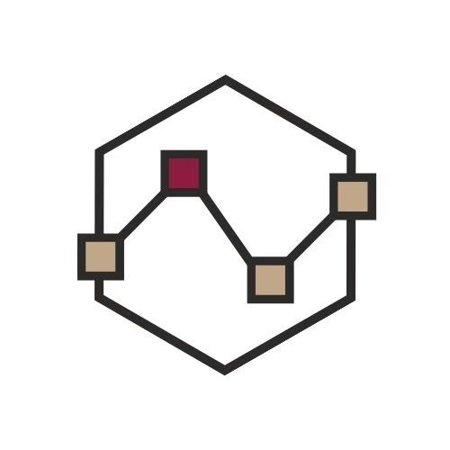
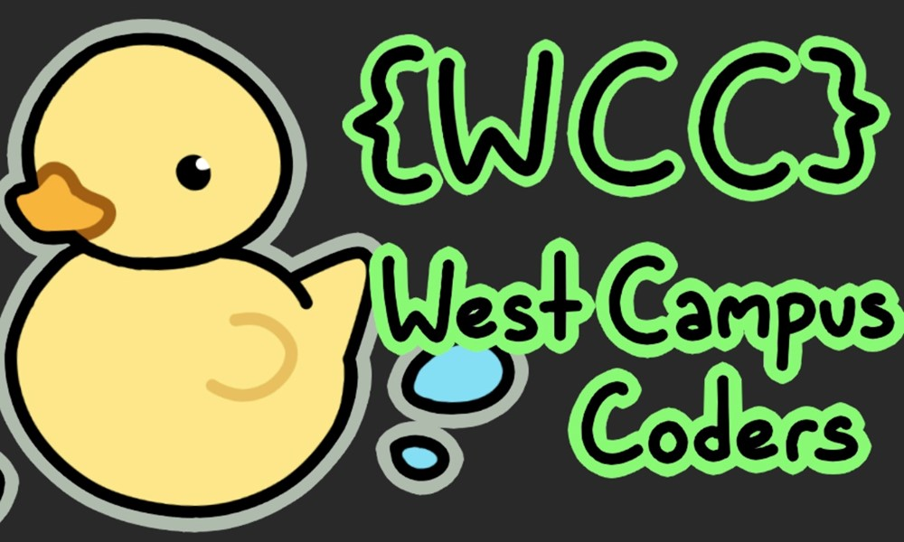
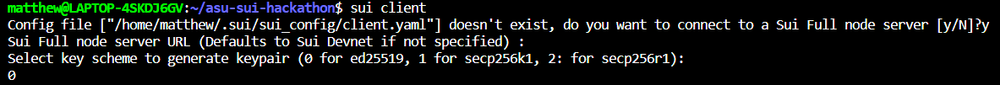
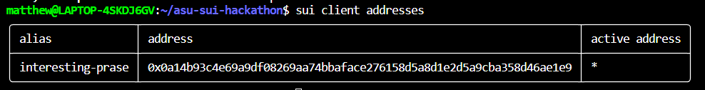

    
<!-- .element: style="display: flex; flex-direction: row" -->
      
      
      
    

<h3 align="center">ASU x Sui Hackathon</h3>

  

    Presented by ASU Blockchain and ASU West Campus Coders
     
    <a href="https://asu-x-sui-hackathon.devpost.com/">Register</a>
    ·
    <a href="https://asu-x-sui-hackathon.devpost.com/project-gallery">View Projects</a>
    ·
    <a href="https://asu-x-sui-hackathon.devpost.com/#prizes">Prizes</a>
  

## Registration
To enter, make sure you have registered for the hackathon on [our devpost page.](https://asu-x-sui-hackathon.devpost.com) There are no restrictions on group size.

## Prizes
We will be awarding $5000 in prizes total, given out in cash. For a project to be eligible for a prize, it must have some involvement with the Sui blockchain, although it is not required that you write any smart contracts or run any transactions on the chain. [You can find the list of prizes here.](https://asu-x-sui-hackathon.devpost.com/#prizes)

## Judges
Hackathon prizes will be awarded based on the rankings of our judges:
- Dragan Boscovic, head of ASU Blockchain Research Lab
- Swathi Punathumkandi, Professor at SCAI, PhD in Blockchain 

## Project Ideas
Don't have any ideas for a project? We have two guides that you can follow to have a skeleton that you can expand upon.

- [Basic Non Fungible Token Skeleton (NFTs)](nft-project/nft.md)
- [Hack Monitoring and Alerting]()

## Dev Environment Setup

We strongly recommend that you use either Linux or Mac to develop your project. If you are using Windows, please consider using either [Windows Subsystem for Linux](https://learn.microsoft.com/en-us/windows/wsl/install) or [Virtualbox](https://www.virtualbox.org/wiki/Downloads) to install Ubuntu and continue using the Linux instructions. Development on Windows is generally not recommended.

### Install Sui Binaries
We are going to use Homebrew to install the package both on Mac and Windows. If you are only used to using homebrew on Mac and not Linux, thats OK, it works the same on both platforms.

1. Run the install command from the [Homebrew website](https://brew.sh/)
2. Run the commands in the resulting "Next Steps" text from the brew install to ensure you have proper dependencies. They may be different on each computer, but on my machine it looks like this: 
Specifically, the command to add homebrew to PATH is important.
1. Run `brew install sui`
2. The first time you run Sui client, you will be prompted for a first time setup. Enter "y" to connect to a full node server, just press enter again to default to devnet, and finally enter 0 to use the Ed25519 key scheme.

3. Run `sui client address` to verify that it works

## Share CLI wallet with Browser Wallet
After running the sui binary, there exists a public private keypair in `~/.sui` that the CLI will use whenever you want to interact with the blockchain. We want to create a browser wallet and share the keypair between them. This will make it easier to interact with your DApp later.

We recommend that you watch the following video to learn how the CLI works:

## More Resources

- Sui Fullstack Tutorial

## Useful libraries and tools

Shinami Gas station
ZKLogin
Ethos Wallet
Suiet wallet

## Schedule