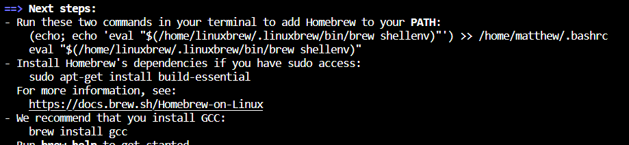

<div align="center">
    <div class="flex-container"><!-- .element: style="display: flex; flex-direction: row" -->
      
      
      
    </div>

<h3 align="center">ASU x Sui Hackathon</h3>

  <p align="center">
    Presented by ASU Blockchain and ASU West Campus Coders
    <br />
    <a href="https://asu-x-sui-hackathon.devpost.com/">Register</a>
    ·
    <a href="https://asu-x-sui-hackathon.devpost.com/project-gallery">View Projects</a>
    ·
    <a href="https://asu-x-sui-hackathon.devpost.com/#prizes">Prizes</a>
  </p>
</div>

## Registration
To enter, make sure you have registered for the hackathon on [our devpost page.](https://asu-x-sui-hackathon.devpost.com) There are no restrictions on group size.

## Prizes
We will be awarding $5000 in prizes total, given out in cash. For a project to be eligible for a prize, it must have some involvement with the Sui blockchain, although it is not required that you write any smart contracts or run any transactions on the chain. [You can find the list of prizes here.](https://asu-x-sui-hackathon.devpost.com/#prizes)

## Judges
Hackathon prizes will be awarded based on the rankings of our judges:
- Dragan Boscovic, head of ASU Blockchain Research Lab
- Swathi Punathumkandi, Professor at SCAI, PhD in Blockchain

## Support
We will be answering questions about the event + developer support in the discord:
- https://discord.gg/AukBGd6pK3

## Project Ideas
Don't have any ideas for a project? We have two guides that you can follow to have a skeleton that you can expand upon.

- [Basic Non Fungible Token Skeleton (NFTs)](nft-project/nft.md)
- [Hack Monitoring and Alerting]()

## 3/29 - Sui Workshop


## 1. Dev Environment Setup

We strongly recommend that you use either Linux or Mac to develop your project. If you are using Windows, please consider using either [Windows Subsystem for Linux](https://learn.microsoft.com/en-us/windows/wsl/install) or [Virtualbox](https://www.virtualbox.org/wiki/Downloads) to install Ubuntu and continue using the Linux instructions. Development on Windows is generally not recommended.

### Install Sui Binaries
We are going to use Homebrew to install the package both on Mac and Windows. If you are only used to using homebrew on Mac and not Linux, thats OK, it works the same on both platforms.

1. Run the install command from the [Homebrew website](https://brew.sh/)

2. Run the commands in the resulting "Next Steps" text from the brew install to ensure you have proper dependencies. They may be different on each computer, but on my machine it looks like this: 

**Specifically, the command to add homebrew to PATH is important.**

1. Run `brew install sui`

2. The first time you run Sui client, you will be prompted for a first time setup. Enter "y" to connect to a full node server, just press enter again to default to devnet, and finally enter 0 to use the Ed25519 key scheme.


3. Run `sui client address` to verify that it works


### 2. Share CLI wallet with Browser Wallet
After running the sui binary, there exists a public private keypair in `~/.sui` that the CLI will use whenever you want to interact with the blockchain. We want to create a browser wallet and share the keypair between them. This will make it easier to interact with your DApp later.
1. Install a Sui wallet. We recommend [Ethos Wallet](https://chromewebstore.google.com/detail/ethos-sui-wallet/mcbigmjiafegjnnogedioegffbooigli?pli=1)

2. Go through the install instructions to create a new wallet, then copy your "mnemonic" or "recovery phrase" from the extension. In Ethos wallet this can be done via the settings icon in the top right, then "security" and "view recovery phrase"

3. Import the mnemonic into your sui CLI with the following command: `sui keytool import "<recovery phrase here>" ed25519`

4. Check that the import worked with `sui client addresses`, and note the alias associated with the wallet address of your browser.

5. Then change to the new wallet with `sui client switch --address <new alias>`


**IMPORTANT! Your 16 word "mnemonic" is equivalent to your Private key. If you share either your mnemonic or your private key with anyone, they will be able to control your wallet and take their money. This is not so important in this hackathon because we are not dealing with real money, but if you ever decide to put any real value onto a blockchain wallet, you need to be extremely careful with your private key and mnemonic.**

We recommend that you watch the following video to learn how the CLI works: [Sui CLI Walkthrough](https://www.youtube.com/watch?v=Ypmjzy_QRM8)

## Optional: Setup Javascript
If you are running into issues such as ```npm: command not found```, you will need to download javascript.

- Download <a href="https://nodejs.org/en/">Nodejs</a>

- Download Node Version Manager (nvm) for Ubuntu/MacOS: ```curl -o- https://raw.githubusercontent.com/nvm-sh/nvm/v0.38.0/install.sh | bash```

- Run the following command: 
```
export NVM_DIR="$HOME/.nvm"
# This loads nvm
[ -s "$NVM_DIR/nvm.sh" ] && \. "$NVM_DIR/nvm.sh"
# This loads nvm bash_completion
[ -s "$NVM_DIR/bash_completion" ] && \. "$NVM_DIR/bash_completion"
```

- Check nvm has been downloaded correctly: ```nvm --version```

### Get a Node version (we will be using 16)
- ```nvm install 16```
- ```nvm use 16```

### Set up Sui Move in IDE
- Install a Code Editor (VS Code Highly recommended): https://code.visualstudio.com/download
- Install Move Analyzer from VS Code Extensions: https://marketplace.visualstudio.com/items?itemName=move.move-analyzer
- Install the following for Syntax Highlighting: 
```cargo install --git https://github.com/move-language/move move-analyzer --branch sui-move --features "address32"```

- More information can be found here: https://docs.sui.io/guides/developer/getting-started/sui-environment

## 3. Counter dApp Example
- 1. Create a new folder in VSCode
- 2. Run the following command: ```npm create @mysten/dapp```
- 3. Select ```react-e2e-counter```

## More Resources

- <a href="https://www.youtube.com/watch?v=FBJjgZiia6g&list=PLvrJ-5wsCykchZnZBIxj1NB_gwZqkfpLz">Sui Fullstack Tutorial</a>
- <a href="https://docs.sui.io/guides">Sui Docs</a>
- <a href="https://sdk.mystenlabs.com/dapp-kit">Sui Dapp Kit</a>

## Wallets
- <a href="https://chromewebstore.google.com/detail/ethos-sui-wallet/mcbigmjiafegjnnogedioegffbooigli">Ethos Wallet</a>
- <a href="https://chromewebstore.google.com/detail/suiet-sui-wallet/khpkpbbcccdmmclmpigdgddabeilkdpd">Suiet Wallet</a>
- <a href="https://chromewebstore.google.com/detail/sui-wallet/opcgpfmipidbgpenhmajoajpbobppdil">Official Sui Wallet</a>

## Schedule


